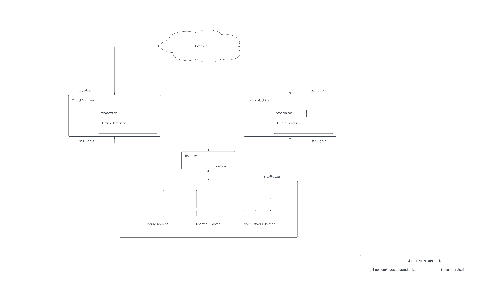

# Gluetun VPN Randomizer

Gluetun VPN Randomizer is a Python application developed for the purpose of
rotating VPN gateways from one or more VPN providers. This will change your
outbound IP address, and optionally your VPN provider, on a random basis within
a given time period (eg, every 2-4 hours).

Some familiarity with Docker, VPN (Wireguard), and Python may be helpful.

## Requirements and Dependencies

- VPN Service (see [Notes](#notes) for options)
- [Gluetun VPN client](https://github.com/qdm12/gluetun)
- [Docker](https://docs.docker.com/engine/install)
- [Docker Compose V2](https://docs.docker.com/compose/migrate)

- Additional Requirements and Dependencies noted in [randomizer](randomizer)

## Quick Start

- Get a functional [docker-compose.yml](docker-compose.yml) working with Gluetun
  (see the provided example).
  - eg, `/usr/local/docker/gluetun/docker-compose.yml`
- Modify the provided [env.example](env.example) and copy to the Gluetun path.
  This provides values to the `environment:` parameters in
  [docker-compose.yml](docker-compose.yml).
  - eg, `/usr/local/docker/gluetun/.env`
- Create a `gluetun_config` directory. This should be the same path defined in
  `volumes:`
  - eg, `/usr/local/docker/gluetun/gluetun_config`
- If multiple providers are being used, extensions of `.env` files must be named
  after [supported Gluetun
  providers](https://github.com/qdm12/gluetun-wiki/tree/main/setup/providers)
  - eg, `.env.ivpn`, `.env.mullvad`, etc.
- Copy [randomizer](randomizer) to a desired location and make it executable
  - `/usr/local/bin/randomizer`
  - `chmod 750 /usr/local/bin/randomizer`
- Modify `randomizer` options (see [Options](#options) below)
- To run as a systemd service, use the provided systemd unit file
  [randomizer.service](randomizer.service)
  - `/etc/systemd/system/randomizer.service`
  - `systemctl daemon-reload`
  - `systemctl status|stop|start randomizer`
- Test/Verify Connection:
  - `docker logs gluetun`
  - `curl -x localhost:8008 ipinfo.io`

## Options

Options are defined in a separate YML configuration file (see
[randomizer.yml](randomizer.yml). The location of this file is defined in
[randomizer](randomizer) by the main parameter `config`.

`debug`: Increases verbosity of logging and frequency of rotation (see also
Logging section and `ttime_min`, `ttime_max`) `shuffle_vpn_provider`: True to
support multiple VPN providers. False if single. Multiple VPN providers require
multiple `.env.*` files `mqtt_enable`: True to support MQTT.
`influxdb_enable`: True to support InfluxDB. `container_name`: This name should
match `container_name` given in `docker-compose.yml`

## Example Architecture

This is one of many examples of using multiple VPN instances in a given
environment.

- LAN: 192.168.1.0/24
  - Consists of a mix of mobile devices, desktops/laptops, and virtual machines
  - All devices in this network use an HTTP/HTTPS proxy of the assigned fronted
    in HAProxy (eg, 192.168.1.100:8118)
- HAProxy: 192.168.1.100
  - Acts as load balancer and distribution to multiple Gluetun VPN instances
  - In this example port 8118 is the listening HTTP/HTTPS proxy
  - See the configuration example [haproxy.cfg](haproxy/haproxy.cfg)
- Virtual Machines: 192.168.20.10, 192.168.30.10
  - Separate subnets of 192.168.20/24 and 192.168.30/24 are optional
  - Each virtual machine contains a running randomizer and Docker container(s)
  - Outbound IP addresses 23.11.82.103, 201.32.11.201 are randomly assigned
    based on VPN provider(s) configured in gluetun and frequency of rotation

## DNS

### Unbound

An example of using Gluetun with
[Unbound](https://nlnetlabs.nl/projects/unbound/about/) is shown in
[/unbound](/unbound)

### Blocky

An example of using Gluetun with [Blocky](https://0xerr0r.github.io/blocky/) is
shown in [/blocky](/blocky)

## Notes

- VPN Service: Temporary VPN service can be obtained via <https://freevpn.us>. See
  [docker-compose.freevpn.us.yml](docker-compose.freevpn.us.yml) for details.
- Currently, randomizer is biased towards Wireguard. OpenVPN may be supported in
  the future, particularly if there is a demand for it.
- If multiple VPN instances are being used, it's highly recommended to use MQTT.
  This prevents conflicting gateways from being used.
- Docker Secrets will be adopted once available
  <https://github.com/qdm12/gluetun/issues/1758>
- [VPN Comparison
  Table](https://www.reddit.com/r/VPN/comments/m736zt/vpn_comparison_table)
